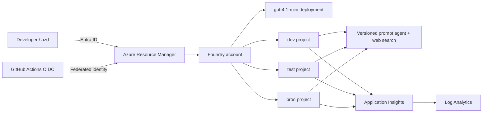

# Foundry prompt agent CI/CD sample

This repository provisions one Microsoft Foundry account with multiple projects, deploys a shared model, creates a versioned prompt agent with live web search in every project, and connects each project to Application Insights. Authentication uses Microsoft Entra ID: `DefaultAzureCredential` locally, workload identity federation in GitHub Actions, and system-assigned managed identities on Foundry resources. No model API keys are used.

## Architecture



The same immutable source configuration in [agent/agent.json](agent/agent.json) is promoted by creating a new agent version in each selected Foundry project. Bicep owns Azure resources and RBAC; the Python SDK owns the prompt-agent definition.

## Local deployment with azd

Prerequisites: Azure CLI, Azure Developer CLI, Python 3.11+, and an Azure subscription where you can create resources and role assignments. Model and web-search availability vary by region and subscription.

```powershell
az login
azd auth login
azd env new foundry-demo

$principalId = az ad signed-in-user show --query id -o tsv
azd env set AZURE_PRINCIPAL_ID $principalId
azd env set AZURE_PRINCIPAL_TYPE User
azd env set AZURE_LOCATION eastus2
azd env set AZURE_AI_PROJECT_NAMES_JSON '["dev","test","prod"]'
azd up
```

`azd up` provisions the infrastructure and runs the promotion script. Re-running it creates a new agent version in each project. To reduce cost, use only `["dev"]` for a demo. To remove the resources, run `azd down --purge`.

## Try the agent

Load the current azd outputs, then invoke any project:

```powershell
azd env get-values | ForEach-Object {
  if ($_ -match '^([^=]+)="(.*)"$') { Set-Item "env:$($Matches[1])" $Matches[2] }
}
.\.venv\Scripts\python.exe scripts\deploy_agent.py invoke --prompt "What changed in Microsoft Foundry this week?"
```

You can also press `F5` in VS Code after creating a workspace-root `.env` from `azd env get-values`. Responses print URL citations, and OpenTelemetry sends invocation traces to the linked Application Insights resource.

## GitHub Actions setup

### Customer quickstart

This flow has been validated end to end on GitHub-hosted Linux runners. The customer must perform one local bootstrap because GitHub cannot authenticate to a new Azure tenant until that tenant trusts the repository. After bootstrap, all infrastructure and agent promotions run in GitHub Actions.

Prerequisites:

- Fork this repository or create a repository from it, then clone that customer-owned repository. If GitHub disables workflows in the fork, open its **Actions** tab and choose **I understand my workflows, go ahead and enable them**.
- Install PowerShell 7, Azure CLI, and GitHub CLI.
- Sign in with an Azure identity that can create resources and assign roles at the target subscription scope.
- Sign in with a GitHub identity that can administer Actions environments and variables in the repository.
- Confirm that `eastus2` supports `gpt-4.1-mini` and that the subscription has at least 10K TPM of Global Standard quota, or change the location/model settings before deployment.

From the repository root, run the one-time bootstrap:

```powershell
az login
gh auth login
.\scripts\bootstrap-github.ps1 -SubscriptionId '<subscription-id>'
```

The script detects the current GitHub repository from its `origin`, reads that repository's OIDC subject format, deploys a user-assigned managed identity, creates matching federated credentials scoped to the `dev`, `test`, and `prod` GitHub Environments, grants the deployment roles, and configures these GitHub environment variables in every stage automatically:

| Variable | Purpose |
| --- | --- |
| `AZURE_CLIENT_ID` | Client ID of the Entra application or user-assigned identity used for OIDC |
| `AZURE_PRINCIPAL_ID` | Object ID of its service principal, used for Foundry RBAC |
| `AZURE_TENANT_ID` | Azure tenant ID |
| `AZURE_SUBSCRIPTION_ID` | Target subscription |
| `AZURE_LOCATION` | Region such as `eastus2` |

After bootstrap completes, open the repository's **Actions** tab, select **Provision and promote Foundry agent**, choose **Run workflow**, keep `foundry-demo` as the shared azd environment name, and run it. The workflow validates the repository, provisions one Foundry account with `dev`, `test`, and `prod` projects, then promotes the agent sequentially through all three projects.

The workflow also runs on pushes to `main`. A push made before bootstrap may fail because the OIDC trust and GitHub variables do not exist yet; run or rerun the workflow after bootstrap. Configure required reviewers on the `test` or `prod` GitHub Environment before the first deployment if approval gates are required.

To target an explicit repository, environment, identity name, or region, pass the corresponding script parameters. Use `-SkipGitHubConfiguration` to create the Azure identity and print its values without changing GitHub settings.

```powershell
.\scripts\bootstrap-github.ps1 `
  -GitHubOwner contoso `
  -GitHubRepository foundry-agent-cicd `
  -GitHubEnvironments dev,test,prod `
  -Location eastus2
```

The workflow runs three sequential deployment jobs: `Deploy dev`, `Deploy test`, and `Deploy prod`. All jobs target one shared azd environment and Foundry account, but each promotes the agent only to its matching Foundry project. A successful stage prints `Promoted web-research-agent version ...` with that project's endpoint.

The bootstrap grants Contributor and Role Based Access Control Administrator at subscription scope because the workflow creates a resource group and project-level role assignments. For a production customer deployment, pre-create the target resource group and narrow both assignments to that scope.

Review the web-search terms and data-boundary notice before using customer data. Resource names are derived from the shared azd environment name, so choose a unique name when deploying multiple copies in one subscription.

## Security notes

- Local authentication is disabled on Foundry and Application Insights.
- The App Insights project connection stores its connection string because that is the platform's supported association mechanism; telemetry export itself supplies an Entra credential.
- Web results are untrusted and can leave the Azure compliance/geographic boundary. Do not put secrets or sensitive personal data in web-search prompts.